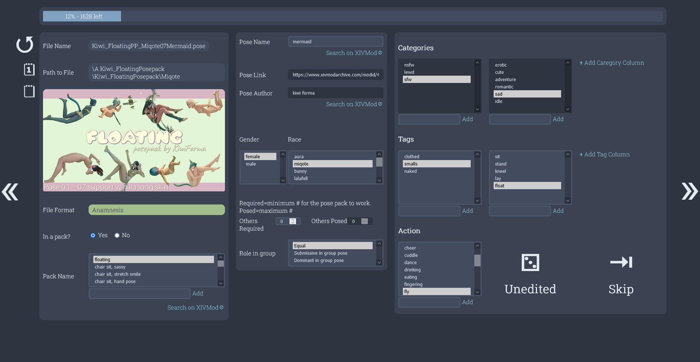

# xiv-pose-organizer

> Windows 10, PHP 8.1, with compatibility for .pose and
.cmp files.

A tool to help you go through and organize all of
your FFXIV poses and make them searchable.

## Software Preview

## Output Preview

(there are 2 output modes: flat and folders - folders for cleaner storage and more structured searching, flat for simpler searching)

# What is this

The point is to go through all of your poses, categorize
them, have extra resources for them (like preview images
and links to the website of the pose), and ultimately
just make them searchable in Anamnesis/CMT.

You run the software, open it in your browser, configure
the software, then you can work through each of your poses.

Clarifying or completing the names of the poses, including
the name of the author, adding the link to where you got
the pose, adding a preview image of the pose, and tagging
and categorizing the pose.

All of this data for all of your poses will then be parsed
out in a standard manner across all of your poses, including
the organization of the files themselves, and the poses will
then be better searchable in Anamnesis/CMT by the correct
pose names, the author, or the categories and tags you chooose.

For more, see the [`use-case.md`](use-case.md) file.

# How to use this

This is a project primarily made for myself and my friend
to make a shared folder in Google Drive with all our poses,
so it's not very well set up for others to use honestly.

But, the basic idea is that you could throw this in
[XAMPP](https://www.apachefriends.org/index.html)
with a
[PHP Installation](https://windows.php.net/download#php-8.1)
(VS16 x64 Non Thread Safe > Zip)
and visit localhost:80 on your computer and run through
the program (something would be clunky since /web is the
root, not the actual folder).

I know it works via my workflow of course, which is to open
[PHPStorm from JetBrains](https://www.jetbrains.com/phpstorm/)
using my 
[PHP Installation](https://windows.php.net/download#php-8.1)
(VS16 x64 Non Thread Safe > Zip) and then run it as a
"PHP Built-in Web Server" > on "localhost" port "80" >
with the document root set as
(projects)"\xiv-pose-organizer\web" then just open up
localhost:80.

Once you confirm your settings and begin working through
your poses you can download and remove poses in between
sessions of organization. It will throw off your place in
the process, so if it does a lot there's a "1st Unedited"
button to go to the first pose that was not worked on.

In the work through process you can click the grey fields
along the left side of the screen to copy the data in the
field. This is useful for copying the "Path to File" to
open the folder of the pose and examine the other poses
in a pack.

---

It tries to parse as much information as it can from the folder
and file names the poses already exist in, to reduce your workload.

It can be configured such that it requests you do as little as
possible, just naming the poses and the authors, and choosing
tags and categories - or for much more work that could be done
little by little over time to also include previews images for
every pose, link to where the pose was downloaded from, how
many people are required for the pose to work and how many
people are posed in a pack of pose files, and so on.

You can set it up to have many different categories and tags that
each pose could be, or just the default of 2 category and 2 tag
options.

# How to code on this

So this is a little bit scuffed on the front-end. Sorry.

As for the back-end, it kept to the architecture plan
pretty well and is fairly well documented and structured.
I think the main oddity of it would be the general
structure as I wanted to prioritize short calls, so
everything just extends off of each other to get calls
like `$poser->get_packs()` and `$poser->get_tags()` vs
`$poser->pose->get_packs()` and `$poser->tags->get_tags()`.

Read the included [`use-case.md`](use-case.md) file for
information on the goal of the code.

[`architecture.md`](architecture.md) is a brief plan from
before the project was written, this is kept primarily
because the project overall was used to help teach the
flow of a project to someone - but you can reference it
and it was generally followed.

Check the [To-Do](todo.md) for planned changes.

---

`/web` is the root of the front-end.

In there `index.php` is the start of the process. It's
close to empty, just loading jquery and css, showing a
loading icon while some of the pose files are initially
parsed.
It starts to get messy when uses `ajax` to poll
`middleman.php` with a page specified.

`middleman.php` is another fairly sparse file, all it does
is load the `web/handle/*` or `web/template/*` file given
a page.

The `web/template/*` files are just HTML.PHP files that
load the base for the settings, work-through (the actual
editing of each pose), and the review steps of the process.
They are a fair bit messy with some of the work-around
nonsense that I did to deal with jQuery's lack of DOM
refreshing, but they're not too dreadful.

The `web/handle/*` files are fairly sparse as well, just
saving the settings data or calling the back-end to save
the pose data, or saving the steps of the review process.

The `web/assets/js/*` files are all the JavaScript required
to run each `template` files, and are included there.

The flow then is `index.php` => `middleman.php`
=> `web/template/configure.php` =>
`web/assets/js/configure.php` ? =>
`web/handle/configure.php`.

If it's a GET request, it goes
to a `template` file, and POST goes to a `handle` file.
When using the caret symbols to go forward and backward
between pages it will send POST requests to save progress,
and a GET request to load the page you're going to.

To work on a specific page:
You would look at the html in the `template` folder,
you would adjust the back-end calls in the `handle` folder,
and adjust the scripting for a page in the `assets/js`
folder.

---

Given the back-end is better documented and close-ish to
the planned architecture I will go into it less.

`/logic/autoload.php` is called and includes everything else.

It first includes the `utilities` folder for global static
methods. After that is the `static_data` and `structures`
folder for ... well ... static data and data structures.

Next is the `core` folder where most of the work-through
process is done - this is the bulk of the code utilized in
actually parsing, modifying, and saving the poses.

Last are the `check` and `review` folders. These are not
populated or called in the MVP I'm initially releasing,
but the `check` folder will contain the methods for 
actually checking the data for the `review` code, and
the `review` folder will contain all the calls to the
`check` folder and give reports back to the user and
links to jump back into the work-through process.

A `/data` folder is utilized for `.json` files containing
settings and step-of-the-process data.

A `/..working` folder is added to the user-configured
poses directory and is where all of the work-in-progress
from the work-through step will be.
Essentially this will double (or more) the size of the
pose folder as the user works through the process, but
also allows for the review steps to work off of progress
that has already been made, and for the process to be
completed intermittently without disrupting the user.
At the end, the pose folder is empty, and this folders'
contents replace it.

# Licensing
    xiv-pose-organizer: a tool to organize poses generated by Anamnesis or CMT.
    Copyright (C) 2022  Ethan Henderson (zbee) <ethan@zbee.codes>

    This program is free software: you can redistribute it and/or modify
    it under the terms of the GNU General Public License as published by
    the Free Software Foundation, either version 3 of the License, or
    (at your option) any later version.

    This program is distributed in the hope that it will be useful,
    but WITHOUT ANY WARRANTY; without even the implied warranty of
    MERCHANTABILITY or FITNESS FOR A PARTICULAR PURPOSE.  See the
    GNU General Public License for more details.

    You should have received a copy of the GNU General Public License
    along with this program; see a LICENSE file.  If not, see
    <https://www.gnu.org/licenses/>.

See the [LICENSE](LICENSE) file.

Includes jQuery 3.6.0, a GPL-compatible licensed library.
